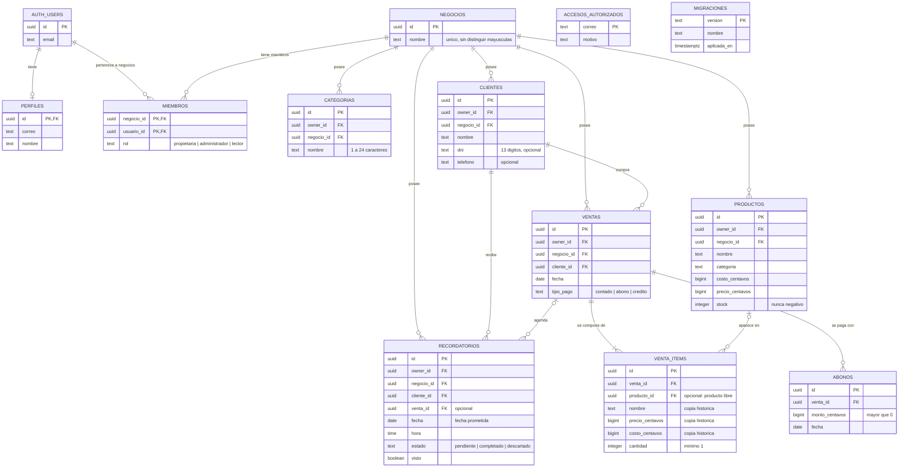

# Esquema relacional de April Collections

Doce tablas creadas por las ocho migraciones del producto. Es el mismo esquema en
producción y en el proyecto de Ciencia de Datos II; solo cambian los datos.

GitHub renderiza el diagrama directamente. Para incluirlo en el PDF, abrir este
archivo en GitHub y capturar, o pegar el bloque en <https://mermaid.live> y exportar
como PNG.

## Cómo leer el esquema

- **El negocio es el dueño de los datos.** Cinco tablas llevan `negocio_id`; es lo que
  decide el acceso mediante RLS. `owner_id` se conserva solo como rastro de quién creó
  cada fila.
- **Una venta son tres tablas.** `ventas` es la cabecera, `venta_items` los productos,
  `abonos` cada pago con su fecha. El saldo pendiente no se guarda: se calcula.
- **El precio de venta es histórico.** `venta_items` copia nombre, precio y costo al
  vender, para que la ganancia de las ventas viejas no cambie si sube el costo.
- **El dinero va en centavos enteros** (`bigint`), nunca en decimales.

## Relaciones y qué pasa al borrar

| Relación | Cardinalidad | Al borrar el padre |
|---|---|---|
| `negocios` → `miembros` | 1 a muchos | Cascada |
| `negocios` → `clientes`, `productos`, `ventas`, `categorias`, `recordatorios` | 1 a muchos | Cascada |
| `clientes` → `ventas` | 1 a muchos | **Restringido**: no se borra una clienta con ventas |
| `ventas` → `venta_items` | 1 a uno o muchos | Cascada |
| `ventas` → `abonos` | 1 a muchos | Cascada |
| `ventas` → `recordatorios` | 0/1 a muchos | Cascada |
| `productos` → `venta_items` | 0/1 a muchos | **Se pone en null**: la línea conserva la copia |
| `clientes` → `recordatorios` | 1 a muchos | Cascada |
| `auth.users` → `perfiles` | 1 a 0/1 | Cascada |

## Tablas sin relaciones y vistas

`accesos_autorizados` es la lista de correos que pueden iniciar sesión.
`migraciones` registra qué scripts ya se aplicaron.

Sobre estas tablas hay cinco vistas de solo lectura: `ventas_con_saldo` calcula
total, cobrado y pendiente de cada venta, y las cuatro `kpi_*` agregan por mes, por
clienta deudora, por día de cobro y por existencias bajas.

`auth.users` pertenece a Supabase Auth, no al esquema público; se muestra porque
cinco tablas apuntan a ella.
