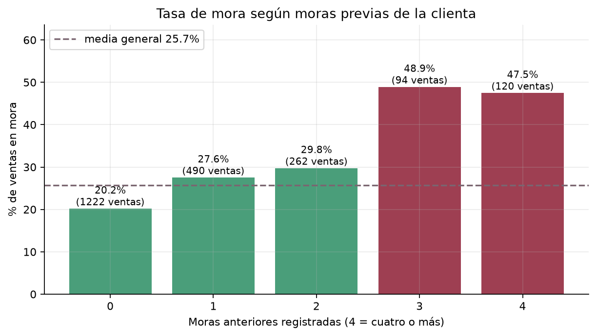
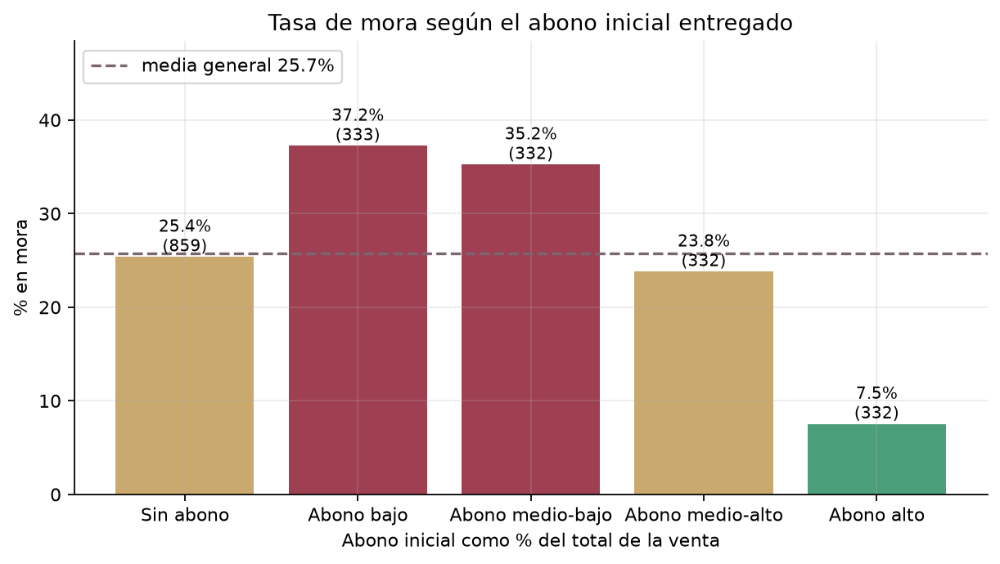
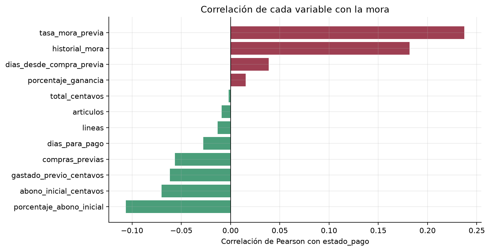
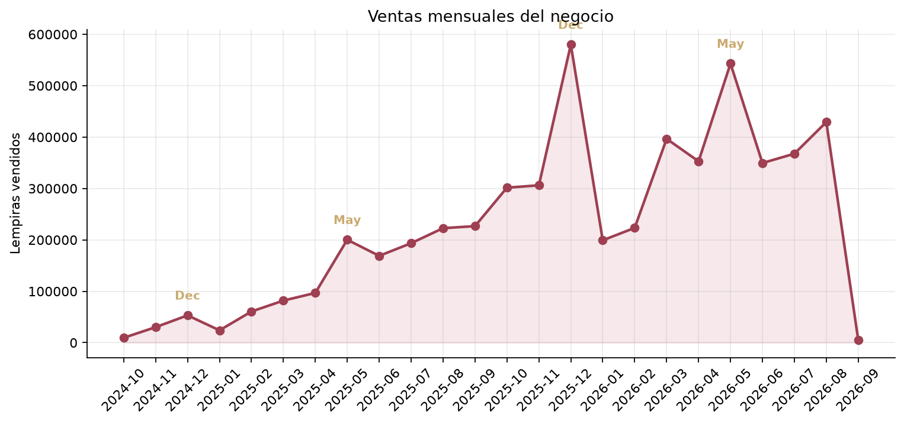
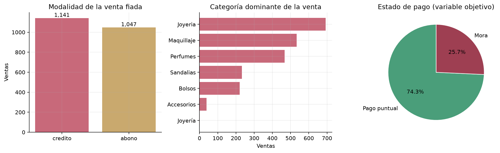
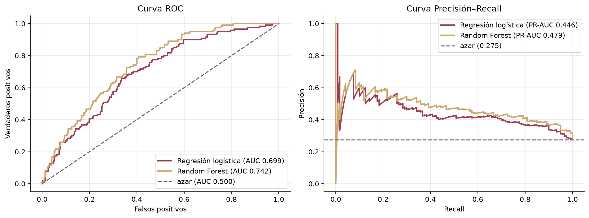
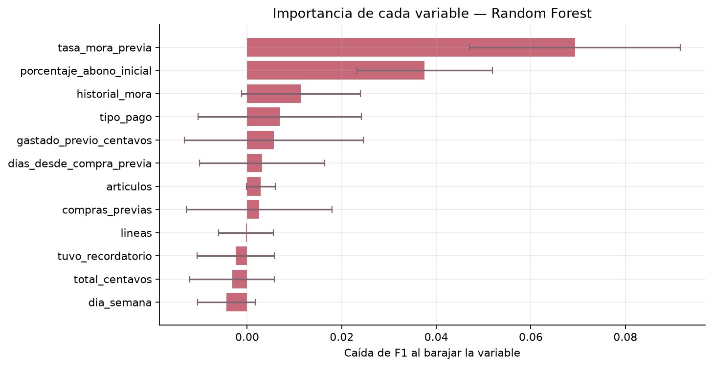
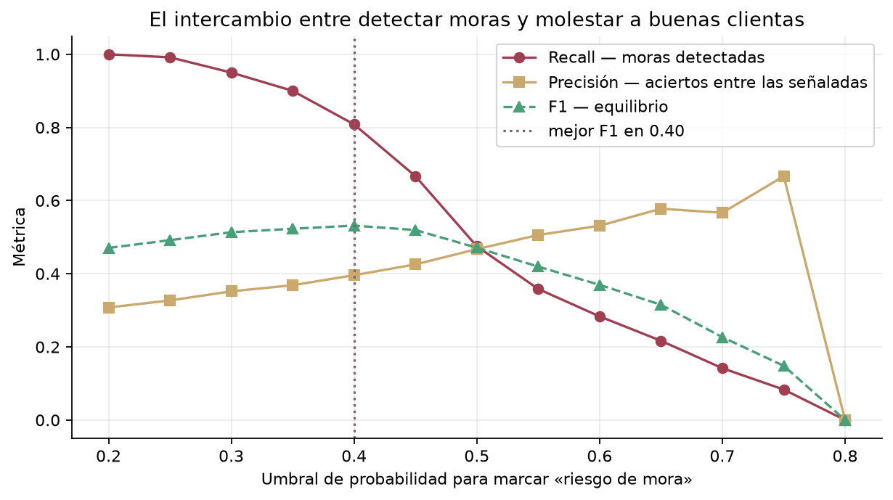
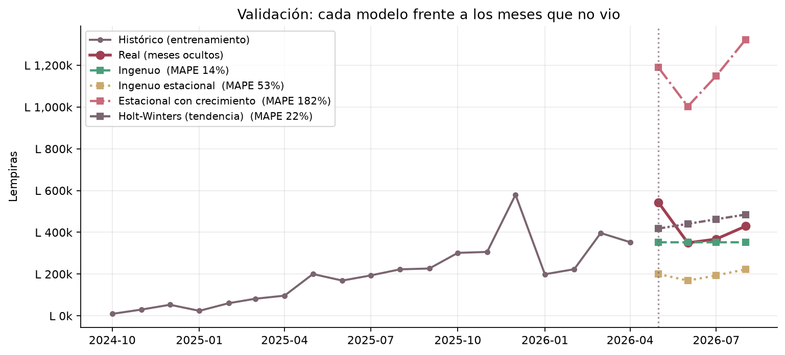
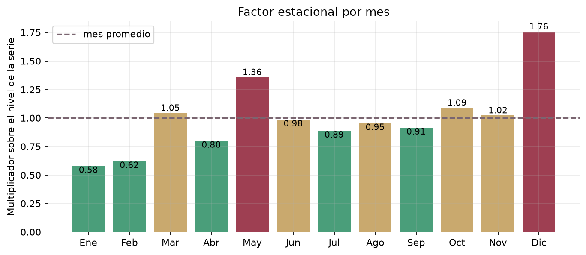

# Aplicación de Ciencia de Datos para Generación de Valor en un Desarrollo Tecnológico

## Predicción de riesgo crediticio y proyección de ventas en April Collections

---

**Universidad Tecnológica Centroamericana · CEUTEC**
**Ciencia de Datos II · Sección 77**

**Docente:** Ing. Naomy Zoey Ríos Reyes

**Grupo 5**

| Integrante | Número de cuenta |
|---|---|
| Kevin Jonathan Zúniga Hernández | 62451208 |
| Jose Nahún Reyes Escobar | 20011170 |
| Wilmer Josué Sánchez Gómez | 62211430 |

**Sede:** Central
**Fecha de entrega:** 19 de septiembre de 2026

**Repositorio:** https://github.com/Wilmer328/CD2_ProyectoFinal
**Producto base:** https://www.jsanchez.site
**Tablero interactivo:** https://cd2proyectofinal-33tjuzgr53xy23jldsgrwu.streamlit.app/

---

<div style="page-break-after: always;"></div>

## Índice

1. [Descripción del proyecto original](#1-descripción-del-proyecto-original)
2. [Problema seleccionado](#2-problema-seleccionado)
3. [Objetivos](#3-objetivos)
4. [Dataset](#4-dataset)
5. [Proceso de ciencia de datos](#5-proceso-de-ciencia-de-datos)
6. [Modelos utilizados](#6-modelos-utilizados)
7. [Resultados y métricas](#7-resultados-y-métricas)
8. [Decisiones que se pueden tomar](#8-decisiones-que-se-pueden-tomar)
9. [Valor agregado demostrado](#9-valor-agregado-demostrado)
10. [Limitaciones](#10-limitaciones)
11. [Futuras mejoras](#11-futuras-mejoras)
12. [Bibliografía](#12-bibliografía)

---

## 1. Descripción del proyecto original

**April Collections** es una aplicación web progresiva (PWA) en uso real, construida para
una vendedora por catálogo en Honduras que comercializa joyería, maquillaje, sandalias y
perfumes. Está publicada en un dominio propio, https://www.jsanchez.site, y su desarrollo
corresponde al proyecto de Ingeniería de Software II de uno de los integrantes del grupo.

El sistema nació para reemplazar un cuaderno. La dueña llevaba a mano las ventas, los
abonos parciales y las deudas de cada clienta, con tres consecuencias que el software
resuelve: la deuda real era invisible sin sumar a mano varias páginas, los cobros
prometidos se olvidaban, y no había forma de saber si el negocio ganaba porque el cuaderno
registraba lo que entraba pero no lo que había costado.

### Arquitectura del producto base

| Capa | Tecnología |
|---|---|
| Interfaz | JavaScript con módulos ES, empaquetado con Vite |
| Persistencia | PostgreSQL gestionado por Supabase |
| Autenticación | Google OAuth, con lista de correos autorizados |
| Autorización | Row Level Security evaluada en el servidor |
| Alojamiento | Vercel, con despliegue automático desde la rama principal |

### Funcionalidades del sistema

- **Registro de ventas** al contado, con abono inicial o a crédito, con descuento
  automático de existencias.
- **Gestión de clientas y deudas**, con seguimiento del saldo pendiente de cada una.
- **Control de inventario** por categorías, con aviso de existencias bajas.
- **Calculadora de precios** a partir del costo y el margen deseado.
- **Recordatorios de cobro** en las fechas que las clientas prometen pagar.
- **Tablero de indicadores** con ventas, ganancia y saldos por periodo.

### El modelo de datos que hace posible este análisis

Una decisión de diseño del producto base resulta determinante para el componente
analítico: **el saldo pendiente no se almacena, se calcula**. Una venta se descompone en
tres tablas —la cabecera, las líneas de producto y cada abono recibido— y el saldo surge
de restar los abonos al total de las líneas.

Esa estructura, pensada para evitar que un saldo guardado quedara desincronizado con sus
propios pagos, tiene un efecto secundario valioso: **el historial completo de pagos está
disponible con fecha**, y sin él no habría forma de reconstruir quién pagó a tiempo y quién
no. Todo este proyecto depende de esa decisión.

Los importes se guardan en **centavos enteros**, nunca como decimales, para evitar que los
errores de punto flotante se acumulen sobre cientos de abonos.

---

## 2. Problema seleccionado

El software resuelve el registro operativo, pero deja sin responder las preguntas
estratégicas. Se identificaron tres, y el proyecto aborda las dos primeras:

### 2.1 Riesgo crediticio (problema principal)

**Casi todo se vende fiado.** De las ventas analizadas, el 60,8% se realiza a crédito o con
abono inicial. La dueña decide caso por caso a quién fiar, basándose en su memoria y su
trato personal con cada clienta.

Esa decisión funciona mientras la clientela es pequeña. Con 380 clientas activas, recordar
quién se atrasó hace ocho meses deja de ser realista, y **el 25,7% de las ventas fiadas
llega a su fecha prometida con saldo pendiente**, lo que en el periodo analizado representa
**L 439.460 sin cobrar a tiempo** sobre L 3.260.970 fiados.

El problema no es la falta de datos: el sistema los registra todos. Es que **nadie los está
leyendo como evidencia**.

### 2.2 Planificación de inventario (problema complementario)

La mercadería se encarga con semanas de antelación. Comprar de menos cuesta ventas que ya
estaban hechas; comprar de más inmoviliza capital en producto que no rota. Sin una
estimación del volumen esperado, la compra se decide por intuición.

### 2.3 Estrategia de precios (identificado, fuera de alcance)

El negocio aplica un margen fijo del 30% por defecto, desvinculado de la rotación real de
cada categoría. Se identificó en el avance del proyecto pero **no se aborda aquí**: exige
datos de elasticidad de demanda que el sistema no registra, y prometerlo sin esos datos
sería prometer algo que no se puede entregar.

---

## 3. Objetivos

### Objetivo general

Integrar un componente de Ciencia de Datos en April Collections que estime el riesgo de
mora de cada clienta y proyecte las ventas mensuales, para convertir los registros
operativos que el sistema ya genera en decisiones informadas sobre a quién fiar y cuánto
inventario comprar.

### Objetivos específicos

1. **Diseñar un canal ETL automatizado** que extraiga los datos transaccionales desde
   PostgreSQL, los transforme en un conjunto analítico y derive la variable objetivo a
   partir del comportamiento de pago observado.
2. **Ejecutar un análisis exploratorio** que identifique qué factores se asocian con el
   incumplimiento y qué estructura temporal tienen las ventas.
3. **Entrenar y evaluar modelos de clasificación supervisada** capaces de estimar la
   probabilidad de mora de una venta fiada, con una metodología de validación que refleje
   cómo se usaría el modelo en producción.
4. **Construir un modelo de proyección** de ventas mensuales para apoyar la planificación
   de compras.
5. **Entregar los resultados en un tablero interactivo** que traduzca las probabilidades a
   acciones concretas.

---

## 4. Dataset

### 4.1 Fuente y naturaleza de los datos

**Los datos son sintéticos, y conviene explicar por qué.**

La aplicación lleva pocas semanas en uso real y acumula un puñado de ventas: una base
insuficiente para entrenar cualquier modelo. Pero hay una segunda razón, más importante:
los datos reales contienen **nombres, números de identidad y teléfonos de clientas** que
nunca consintieron aparecer en un trabajo académico. Usarlos habría sido una falta ética,
no un atajo técnico.

Se optó por generar un conjunto sintético que **replica exactamente la estructura real**:
las mismas tablas, las mismas columnas, los mismos tipos y restricciones. El esquema se
levantó ejecutando las ocho migraciones SQL del producto en un proyecto de Supabase
independiente, de modo que el ETL extrae de una base PostgreSQL real y no de un archivo
plano.

El generador **no asigna la mora**. Simula el comportamiento de pago —quién paga rápido,
quién se atrasa, quién deja saldo— y la etiqueta la deriva después el ETL a partir de los
abonos y las fechas prometidas, igual que habría que hacerlo con datos reales. Si la
etiqueta se pusiera en el generador, el modelo aprendería una regla escrita por una persona
en lugar de un patrón de los datos.

Cada clienta simulada tiene una **fiabilidad latente** que nunca se guarda en ninguna tabla.
De ella dependen cuánto tarda en pagar, en cuántas cuotas, si llega a saldar y hasta qué
modalidad de pago se le ofrece. El modelo no puede verla; solo ve sus consecuencias.
Estimarla a partir de esas huellas es el problema.

El generador usa **semilla fija**: dos ejecuciones producen archivos idénticos byte a byte,
lo que hace el análisis completamente reproducible.

### 4.2 Volumen

| Concepto | Cantidad |
|---|---|
| Periodo cubierto | 24 meses (octubre 2024 – agosto 2026) |
| Clientas | 406 (400 generadas + 6 de la demostración original) |
| Productos | 49 en 6 categorías |
| Ventas totales | 3.678 |
| Líneas de venta | 6.389 |
| Abonos registrados | 6.549 |
| Recordatorios de cobro | 1.637 |
| **Filas cargadas en total** | **18.668** |
| **Ventas fiadas analizables** | **2.188** |

### 4.3 Diccionario de datos del conjunto analítico

Cada fila es **una venta fiada**. Las ventas al contado se excluyen: se pagan en el acto y
no pueden entrar en mora.

#### Identificación (no entran al modelo)

| Campo | Tipo | Descripción |
|---|---|---|
| `id` | UUID | Identificador de la venta |
| `cliente_id` | UUID | Identificador de la clienta |
| `cliente_nombre` | Texto | Nombre, solo para mostrar en el tablero |
| `fecha` | Fecha | Fecha de la venta |

#### Variables predictoras (17)

| Campo | Tipo | Descripción |
|---|---|---|
| `tipo_pago` | Categórico | `credito` o `abono` (con anticipo inicial) |
| `categoria_producto` | Categórico | Categoría dominante por importe |
| `total_centavos` | Entero | Total de la venta en centavos |
| `abono_inicial_centavos` | Entero | Entregado el mismo día de la venta |
| `porcentaje_abono_inicial` | Decimal | El anterior como % del total |
| `porcentaje_ganancia` | Decimal | Margen sobre el precio de venta |
| `articulos` | Entero | Unidades vendidas |
| `lineas` | Entero | Productos distintos en la venta |
| `dias_para_pago` | Entero | Días entre la venta y la fecha prometida |
| `tuvo_recordatorio` | Booleano | Si se agendó un aviso de cobro |
| `historial_mora` | Entero | Moras **anteriores** de esa clienta |
| `compras_previas` | Entero | Compras fiadas **anteriores** |
| `tasa_mora_previa` | Decimal | `historial_mora / compras_previas` |
| `gastado_previo_centavos` | Entero | Acumulado **anterior** de esa clienta |
| `dias_desde_compra_previa` | Entero | Días desde su compra anterior (−1 si es la primera) |
| `mes` | Entero | Mes de la venta (1–12) |
| `dia_semana` | Entero | Día de la semana (0–6) |

#### Variable objetivo

| Campo | Tipo | Descripción |
|---|---|---|
| `estado_pago` | Binario | **1** = mora · **0** = pago puntual |

#### Campos auxiliares excluidos del modelo por contener la respuesta

| Campo | Por qué se excluye |
|---|---|
| `pendiente_al_corte` | **Es la etiqueta disfrazada**: la mora se define como que sea mayor que cero |
| `cobrado_al_corte` | Junto con el total determina el pendiente |
| `fecha_corte` | Información posterior al momento de la decisión |

### 4.4 Definición de la variable objetivo

> Una venta fiada está **en mora** si, al llegar su fecha de corte, todavía tenía saldo
> pendiente.

La **fecha de corte** es la que la clienta prometió, registrada en el recordatorio de cobro.
Cuando no se agendó recordatorio no existe promesa registrada y se asume un plazo de 30
días desde la venta.

Esta definición tiene dos consecuencias metodológicas que se detallan en la sección 5.

---

## 5. Proceso de ciencia de datos

### 5.1 Extracción (E)

Se consulta directamente PostgreSQL mediante SQLAlchemy y `psycopg`, sin pasar por la API
REST. Seis consultas traen las tablas operativas completas: `clientes`, `productos`,
`ventas`, `venta_items`, `abonos` y `recordatorios`.

Se usa SQL y no un ORM de forma deliberada: las agregaciones las resuelve el motor de base
de datos mucho mejor que Python recorriendo filas, y el SQL queda a la vista de quien revise
el trabajo.

### 5.2 Transformación (T)

Aquí se construye la variable objetivo y las predictoras. Dos errores clásicos se evitan de
forma explícita, porque ambos producen modelos que parecen excelentes y no sirven.

#### Censura a la derecha

Una venta realizada hace tres días con promesa a treinta **no está en mora**: aún no le
toca pagar. Marcarla como «puntual» sería afirmar algo que nadie sabe.

Se excluyeron **48 ventas** cuya fecha de corte todavía no había llegado. Sin esta
exclusión, el modelo sobrestimaría sistemáticamente lo bien que paga la gente, porque las
ventas recientes —que aún no han podido fallar— entrarían contadas como buenas.

#### Fuga de información (*data leakage*)

El historial de mora de una clienta debe contar **solo las moras anteriores** a la venta
que se evalúa. Si se le pasara el total de moras de toda su vida, el modelo estaría viendo
el futuro: para predecir la venta de marzo usaría la mora de agosto.

Un modelo así obtiene métricas altísimas en las pruebas y falla en producción, porque el día
que hay que decidir si fiar, ese futuro todavía no ha ocurrido.

El historial se calcula recorriendo las ventas de cada clienta **en orden cronológico** y
restando la fila actual del acumulado. Sin ese desplazamiento la venta se contaría a sí
misma, que es la forma más sutil de fuga porque «solo son sumas acumuladas».

**Verificación realizada:** se comprobó fila por fila que el historial de cada venta
coincide exactamente con el acumulado anterior. Resultado: **0 desajustes en 2.188 filas**,
**0 ventas** cuyo historial incluyera su propio resultado, y una correlación
historial–objetivo de **0,182**: informativa, y muy lejos del ~1,0 que delataría fuga.

### 5.3 Limpieza de datos

| Problema | Tratamiento |
|---|---|
| **Categorías duplicadas sintácticamente** | Existían «Joyeria» y «Joyería» como rubros distintos. El índice único de la base compara en minúsculas pero no ignora las tildes. Se homologan agrupando por clave sin diacríticos y conservando de cada grupo la grafía más frecuente. |
| **Cadenas vacías donde corresponde NULL** | Un campo opcional vacío en CSV llega como `''`; la base espera `NULL`. Insertar `''` rompería el índice parcial del DNI, que solo aplica a los que tienen valor. |
| **Ventas sin líneas** | Una venta sin productos no tiene importe que cobrar. Se descartan por no ser analizables. |
| **Mes incompleto al final de la serie** | El último mes del histórico tiene cuatro ventas porque ahí se cortan los datos. Dejarlo mostraría un desplome del 99% que es un artefacto, no una caída del negocio. Se detecta comparando contra la mediana reciente y se excluye. |
| **Valores faltantes** | El conjunto analítico final tiene **cero nulos**. Los campos opcionales de la aplicación (DNI, teléfono) no entran al análisis: un documento de identidad no dice nada sobre si alguien va a pagar. |

### 5.4 Carga (L)

El conjunto resultante se guarda en **Parquet** y en CSV. Parquet conserva los tipos: un CSV
devuelve las fechas como texto y los enteros como decimales, y el mismo análisis daría
números distintos según quién lo abriera. El CSV se conserva para poder abrirlo en Excel.

### 5.5 Análisis exploratorio (EDA)

#### Hallazgo 1 — El historial de la clienta es la señal más fuerte



| Moras previas | Tasa de mora | Ventas |
|---|---|---|
| 0 | **20,2%** | 1.222 |
| 1 | 27,6% | 490 |
| 2 | 29,8% | 262 |
| 3 o más | **48,1%** | 214 |

La relación es monótona y pronunciada: quien nunca falló ronda el 20%, quien acumula tres o
más atrasos supera el 48%. **Confirma la hipótesis planteada en el avance del proyecto.**

#### Hallazgo 2 — El abono inicial separa el riesgo, y es accionable



Entre las ventas que llevaron anticipo, la mora cae del **37,2%** en el cuartil más bajo al
**7,5%** en el más alto. A diferencia del historial, **esto la dueña sí puede decidirlo**
antes de entregar la mercadería.

Los tramos se definieron por cuartiles y no con cortes redondos elegidos a mano. Con cortes
fijos, uno de los grupos quedaba con nueve ventas y una tasa del 100%: una cifra que parece
un hallazgo rotundo y es ruido de muestra pequeña.

**Una advertencia sobre este resultado.** El grupo «sin abono inicial» presenta *menos* mora
(25,4%) que el de «abono bajo» (37,2%), lo cual parece contradictorio. No lo es: es un
**factor de confusión**. Las ventas sin anticipo son de crédito puro, y esa modalidad se
concede precisamente a las clientas en las que ya se confía. El grupo no se formó al azar,
sino por una decisión previa que ya incorporaba información sobre el riesgo. Es un ejemplo
de por qué una tabla cruzada no demuestra causalidad.

#### Hallazgo 3 — Ninguna variable resuelve el problema por sí sola



Ninguna correlación supera 0,2 en valor absoluto. **Esto es lo correcto**: si una sola
variable correlacionara 0,9 con la mora, lo primero sería sospechar de una fuga de
información. El riesgo está en la **combinación**, no en un indicador aislado, y esa es la
razón para probar un modelo no lineal capaz de capturar interacciones.

#### Hallazgo 4 — Las ventas tienen estacionalidad marcada



Mayo y diciembre destacan sobre el resto, coincidiendo con el día de la madre y la navidad.
Enero y febrero caen, tras el gasto navideño.

#### Hallazgo 5 — El desbalance es moderado y obliga a elegir bien las métricas



El 74,3% de las ventas fiadas se paga a tiempo. Un modelo que predijera «nadie cae en mora»
acertaría el 74,3% y **no detectaría un solo caso de los que cuestan dinero**. La exactitud
queda descartada como métrica principal.

---

## 6. Modelos utilizados

### 6.1 Clasificación: riesgo de mora

Se compararon tres modelos:

| Modelo | Justificación |
|---|---|
| **Línea base** (`DummyClassifier`) | Predice siempre la clase mayoritaria. No sirve para nada, y ese es su valor: cualquier modelo que no la supere claramente no aporta. |
| **Regresión logística** | Modelo lineal e interpretable: cada variable tiene un coeficiente que indica dirección y peso. Es la referencia a batir. |
| **Random Forest** | Conjunto de 400 árboles. Captura interacciones —que el monto alto solo sea peligroso *cuando además* hay historial— que un modelo lineal no puede ver. |

Los dos últimos usan `class_weight="balanced"`: sin esa corrección, ante un 74% de pagos
puntuales la forma más fácil de minimizar el error es predecir «paga» siempre.

El Random Forest se limitó a `max_depth=8` y `min_samples_leaf=15`. Sin esos topes el
bosque memoriza el conjunto de entrenamiento en lugar de aprender de él.

### 6.2 Validación temporal, no aleatoria

**Es la decisión metodológica más importante del proyecto.**

Lo habitual es repartir las filas al azar. Aquí sería un error por dos razones:

1. **Una clienta aparece varias veces.** Con reparto aleatorio, su compra de agosto puede
   caer en entrenamiento y la de marzo en prueba: el modelo usaría el futuro de esa persona
   para predecir su pasado.
2. **No es como se usará.** En producción el modelo se entrena con lo ocurrido hasta hoy y
   predice lo de mañana. Evaluarlo de otra forma mide algo que nunca ocurrirá.

| Partición | Ventas | Periodo | Tasa de mora |
|---|---|---|---|
| Entrenamiento | 1.751 | hasta 2026-05-28 | 25,3% |
| Prueba | 437 | desde 2026-05-29 | 27,5% |

Las dos particiones tienen proporciones de mora similares, lo que indica que el periodo de
prueba no es atípico.

### 6.3 Series de tiempo: proyección de ventas

| Modelo | Descripción |
|---|---|
| **Ingenuo** | El mes que viene será igual al anterior |
| **Ingenuo estacional** | El mes que viene será como el mismo mes del año pasado |
| **Estacional con crecimiento** | El mismo mes del año pasado, corregido por la tasa de crecimiento interanual |
| **Holt-Winters (tendencia)** | Suavizado exponencial con tendencia |

**Holt-Winters va sin componente estacional por necesidad, no por elección.** `statsmodels`
exige dos ciclos completos —24 meses— en el conjunto de entrenamiento, y al reservar cuatro
meses para validar quedan 19. Forzarlo habría obligado a entrenar sin validación, o a
recortar la prueba hasta que cuadrara: ajustar la evaluación para que el modelo pase.

Por la misma razón, la descomposición de la serie se implementó **a mano** por el método
clásico de cociente sobre media móvil: `seasonal_decompose` requiere 24 observaciones y tras
excluir el mes incompleto quedan 23. La alternativa —devolver ese mes para llegar al
mínimo— habría sido falsear los datos para satisfacer a una librería.

---

## 7. Resultados y métricas

### 7.1 Clasificación de riesgo de mora

| Modelo | Exactitud | Precisión | Recall | F1 | ROC-AUC | PR-AUC |
|---|---|---|---|---|---|---|
| Línea base | 0,725 | 0,000 | **0,000** | 0,000 | 0,500 | 0,275 |
| Regresión logística | 0,668 | 0,419 | 0,542 | 0,473 | 0,699 | 0,446 |
| **Random Forest** | 0,707 | 0,467 | 0,475 | 0,471 | **0,742** | **0,479** |

**La línea base merece atención.** Obtiene la exactitud más alta de las tres —72,5%— y un
recall de **cero**: no detecta ni una sola mora. Es la demostración numérica de por qué la
exactitud no puede medir este problema.



### 7.2 Criterio de selección

Se eligió por **PR-AUC**, no por F1.

F1 se calcula al umbral 0,5, que es un número arbitrario, y con él ambos modelos quedan
prácticamente empatados (0,473 contra 0,471): elegir por esa diferencia sería elegir por
ruido. PR-AUC resume lo bien que el modelo **ordena** el riesgo con independencia del
umbral, que es lo que corresponde aquí porque la salida útil es un puntaje para priorizar
clientas y el umbral se ajusta después según lo que prefiera el negocio.

Se prefiere PR-AUC sobre ROC-AUC porque con clases desbalanceadas el segundo resulta
optimista: premia acertar la clase mayoritaria, que es justamente la que no interesa.

### 7.3 Qué mira el modelo



Por importancia de permutación, las variables dominantes son **`tasa_mora_previa`** y
**`porcentaje_abono_inicial`**, seguidas de **`historial_mora`**.

Coincide con el análisis exploratorio y con lo que diría cualquiera que conozca el negocio.
**Que el modelo llegue por su cuenta a lo que la intuición ya sospechaba es una señal de que
aprendió el fenómeno** y no un artefacto de los datos.

### 7.4 El umbral es una decisión de negocio



Bajar el umbral detecta más moras a costa de más falsas alarmas; subirlo hace lo contrario.
La elección correcta depende de cuánto duele cada error:

- **Falso negativo** (predice «paga» y no paga): se fía a quien no debía. **Cuesta dinero.**
- **Falso positivo** (predice «mora» y sí paga): se le pide anticipo a una buena clienta.
  **Cuesta incomodidad, y quizá una venta.**

El umbral que maximiza F1 en la validación es **0,40**, y es el que usa el tablero. No es
una recomendación definitiva: es un punto de partida que la dueña puede mover.

### 7.5 Proyección de ventas



| Modelo | MAPE |
|---|---|
| **Ingenuo** | **14%** |
| Holt-Winters (tendencia) | 22% |
| Ingenuo estacional | 53% |
| Estacional con crecimiento | 182% |

**Gana el modelo más simple, y eso enseña más que si hubiera ganado el sofisticado.**

Con una serie corta y en crecimiento, «el mes que viene se parecerá a este» resulta difícil
de batir: cualquier modelo más ambicioso debe estimar parámetros con muy pocos datos, y cada
parámetro mal estimado añade error.

**El ingenuo estacional falla** porque el negocio creció: el mismo mes del año pasado
corresponde a un negocio bastante más pequeño.

**«Estacional con crecimiento» se dispara** a un MAPE del 182%. Corrige lo anterior
multiplicando por la tasa de crecimiento interanual, que en esta serie resulta ser de casi
**6x** porque los primeros meses del histórico son el **arranque** del negocio, cuando la
clientela apenas se formaba. El modelo confunde arrancar con crecer, extrapola ese ritmo y
proyecta más del doble de lo real.

Se conserva en la comparación a propósito: **extrapolar el crecimiento de una fase de
arranque es una de las formas más fáciles de producir una proyección absurda.**



La estacionalidad **se ve con claridad pero no se pudo aprovechar**: los dos modelos que la
usan quedaron por detrás del que la ignora. Con dos observaciones por mes no hay base
suficiente para estimarla.

---

## 8. Decisiones que se pueden tomar

El componente traduce sus salidas a cuatro acciones concretas, implementadas en el tablero:

| Puntaje de riesgo | Acción recomendada |
|---|---|
| Menor a 25 | Fiar con normalidad |
| 25 – 40 | Fiar, pero agendar recordatorio de cobro |
| 40 – 60 | Pedir abono inicial alto (50% o más) |
| Mayor a 60 | Vender solo al contado |

Los cortes no salen de la estadística sino del negocio: el intermedio es el que optimizó F1
en la validación, y los otros dos se fijaron para que las franjas sean accionables.

**Sobre la escala del puntaje.** El modelo se entrenó con `class_weight="balanced"`, que
reequilibra las clases al 50/50 para impedir que aprenda a responder «paga» siempre. Ese
ajuste, necesario, **desplaza los puntajes hacia arriba**: el promedio es 43,6% mientras la
tasa de mora real del histórico es 25,7%.

La consecuencia es que **el puntaje sirve para ordenar clientas entre sí, no para leerse
como probabilidad literal**: un 45 no significa «45 de cada 100 fallarán». Como la decisión
que habilita es de priorización —a quién pedirle más anticipo antes que a quién—, el orden
es lo que importa, y el orden sí es válido. Calibrar la escala con `CalibratedClassifierCV`
queda apuntado en futuras mejoras.

**Decisiones habilitadas:**

1. **A quién fiar y bajo qué condiciones**, con evidencia en lugar de memoria.
2. **Cuánto anticipo pedir**, graduado según el riesgo en vez de una política uniforme.
3. **A quién priorizar en la gestión de cobro**, ordenando por riesgo y monto pendiente.
4. **Cuánto inventario comprar** para el próximo mes, con un margen de error explícito.
5. **Cuándo comprar con antelación**: mayo y diciembre exigen preparar existencias semanas
   antes; enero y febrero permiten reducirlas y liberar capital.

---

## 9. Valor agregado demostrado

### 9.1 Mejor toma de decisiones

Antes, la decisión de fiar dependía de la memoria. Ahora existe un puntaje que ordena a las
380 clientas por riesgo, construido sobre 2.188 ventas fiadas con su historial completo de
pagos.

El modelo detecta el **47,5%** de las moras con una precisión del **46,7%**. Sin él, el
punto de comparación es la línea base: **0% de detección**.

### 9.2 Comprensión del cliente

El análisis cuantificó lo que antes era intuición: una clienta con tres o más atrasos previos
tiene **2,4 veces** más probabilidad de caer en mora que una sin historial (48,1% frente a
20,2%). El anticipo entregado divide el riesgo por cinco entre el cuartil más bajo y el más
alto.

### 9.3 Optimización de procesos

La gestión de cobro deja de ser una lista plana de deudoras para convertirse en una lista
priorizada por riesgo y monto. El esfuerzo se concentra donde hay más que perder.

### 9.4 Automatización

El proceso completo —generación, carga, extracción, transformación— se ejecuta con tres
comandos y es **totalmente reproducible** gracias a la semilla fija. Cualquier integrante
del equipo obtiene exactamente los mismos resultados.

### 9.5 Diferenciación

Las aplicaciones de gestión de ventas por catálogo registran transacciones. April
Collections, con este componente, **estima riesgo y recomienda acciones**. Es la diferencia
entre un cuaderno digital y un sistema que aconseja.

### 9.6 El puente hacia la aplicación

El componente produce un puntaje por clienta que la aplicación podría consumir con una
consulta directa, mostrando un indicador de riesgo junto a cada nombre.

**Deliberadamente no está conectado a producción.** Un modelo entrenado con datos sintéticos
no debe influir en decisiones que afectan a personas reales. La integración se documenta como
posible y se deja para cuando exista histórico real suficiente para validarlo.

---

## 10. Limitaciones

1. **Los datos son sintéticos.** El modelo aprendió de un comportamiento simulado con la
   estructura real de la aplicación. Con datos reales los números cambiarán; **lo que se
   traslada es la metodología, no los coeficientes**.

2. **El plazo por defecto introduce un sesgo conocido.** Cuando una venta no tuvo
   recordatorio agendado no existe fecha prometida registrada, y se asume un plazo de 30
   días — más generoso que los 8 o 15 que se pactan de palabra. Esas ventas aparecen con
   **menos mora de la real**. No puede corregirse porque el dato no existe; se declara, y
   `tuvo_recordatorio` entra como variable para que el modelo pueda tenerlo en cuenta.

3. **El grupo sin abono inicial no es comparable.** Se concede a quien ya goza de confianza,
   de modo que su baja mora refleja esa selección previa y no el efecto de no pedir
   anticipo. Ninguna métrica corrige este factor de confusión.

4. **Dos ciclos anuales son insuficientes para modelar estacionalidad.** Cada factor
   estacional se estima con dos observaciones, y ni siquiera alcanzan para que `statsmodels`
   acepte descomponer la serie.

5. **La serie incluye la fase de arranque del negocio**, lo que hizo fracasar por completo a
   uno de los modelos de proyección.

6. **El desempeño es moderado, no espectacular.** Un ROC-AUC de 0,742 ordena el riesgo
   claramente mejor que el azar, pero está lejos de ser infalible. Predecir comportamiento
   humano con diecisiete variables no produce 0,95 — y si lo produjera, habría que sospechar
   de una fuga de información.

7. **La validación de la proyección usa cuatro meses.** Con tan pocos puntos, la ventaja del
   modelo ingenuo podría deberse en parte al azar. Lo que sí puede afirmarse con seguridad es
   lo contrario: los modelos que fallan por mucho, fallan de verdad.

8. **Esto no decide por nadie.** El componente ordena prioridades para una persona que conoce
   a sus clientas. Negar crédito basándose en un modelo entrenado con datos simulados sería
   irresponsable.

---

## 11. Futuras mejoras

### Corto plazo

1. **Validar con datos reales** conforme la aplicación acumule historial. Es el paso que
   convierte este trabajo de ejercicio metodológico en herramienta.
2. **Registrar el plazo prometido en la venta**, no solo en el recordatorio. Es un cambio
   pequeño en el producto base que eliminaría la limitación 2 por completo.
3. **Reentrenar periódicamente.** El comportamiento de pago cambia; un modelo congelado
   envejece.
4. **Calibrar la escala del puntaje** con `CalibratedClassifierCV`, para que el número pueda
   leerse como una probabilidad real y no solo como un orden relativo.

### Mediano plazo

4. **Integrar el puntaje en la aplicación**, mostrando el indicador junto a cada clienta en
   el momento de registrar una venta — que es cuando la decisión se toma.
5. **Modelo de recuperación**: no solo quién caerá en mora, sino quién terminará pagando
   tarde frente a quién no pagará nunca. Son dos problemas distintos con respuestas distintas.
6. **Segmentación de clientas** con K-Means sobre frecuencia, monto y puntualidad, para
   diseñar estrategias diferenciadas por grupo.

### Largo plazo

7. **Proyección por categoría de producto** en lugar de agregada, que es lo que realmente
   necesita una orden de compra.
8. **Optimización de inventario** combinando la proyección con costos de almacenamiento y
   rotación.
9. **Análisis de elasticidad de precios**, el tercer problema identificado y no abordado,
   cuando se disponga de datos suficientes.

---

## 12. Bibliografía

Aggarwal, C. C. (2020). *Linear Algebra and Optimization for Machine Learning*. Springer.

Breiman, L. (2001). Random Forests. *Machine Learning*, 45(1), 5–32.
https://doi.org/10.1023/A:1010933404324

Géron, A. (2022). *Hands-On Machine Learning with Scikit-Learn, Keras, and TensorFlow*
(3.ª ed.). O'Reilly Media.

Hyndman, R. J., & Athanasopoulos, G. (2021). *Forecasting: Principles and Practice*
(3.ª ed.). OTexts. https://otexts.com/fpp3/

Kaufman, S., Rosset, S., Perlich, C., & Stitelman, O. (2012). Leakage in data mining:
Formulation, detection, and avoidance. *ACM Transactions on Knowledge Discovery from Data*,
6(4), 1–21. https://doi.org/10.1145/2382577.2382579

McKinney, W. (2022). *Python for Data Analysis* (3.ª ed.). O'Reilly Media.

Pedregosa, F., et al. (2011). Scikit-learn: Machine Learning in Python. *Journal of Machine
Learning Research*, 12, 2825–2830.

Saito, T., & Rehmsmeier, M. (2015). The precision-recall plot is more informative than the
ROC plot when evaluating binary classifiers on imbalanced datasets. *PLoS ONE*, 10(3).
https://doi.org/10.1371/journal.pone.0118432

Seabold, S., & Perktold, J. (2010). Statsmodels: Econometric and statistical modeling with
Python. *Proceedings of the 9th Python in Science Conference*.

Supabase. (2026). *Supabase Documentation*. https://supabase.com/docs

---

## Anexo — Reproducir el análisis

```bash
git clone https://github.com/Wilmer328/CD2_ProyectoFinal.git
cd CD2_ProyectoFinal

python -m venv .venv
.venv\Scripts\activate
pip install -r requirements.txt

copy .env.ejemplo .env          # y colocar la cadena de conexión a Supabase

python -m datos.generar         # dataset sintético (semilla fija)
python -m etl.cargar            # carga a Supabase (idempotente)
python -m etl.ejecutar          # extracción, transformación y dataset analítico

jupyter lab notebooks/          # los tres cuadernos
streamlit run dashboard/app.py  # el tablero
```

**Estructura del repositorio**

```
supabase/migrations/   las 8 migraciones del producto, sin modificar
datos/generar.py       generador del conjunto sintético
etl/                   conexión, carga, extracción, transformación
notebooks/             01 EDA · 02 riesgo de mora · 03 proyección
modelos/               modelo entrenado y métricas en JSON
dashboard/app.py       tablero Streamlit
docs/figuras/          las 18 figuras de este documento
```
